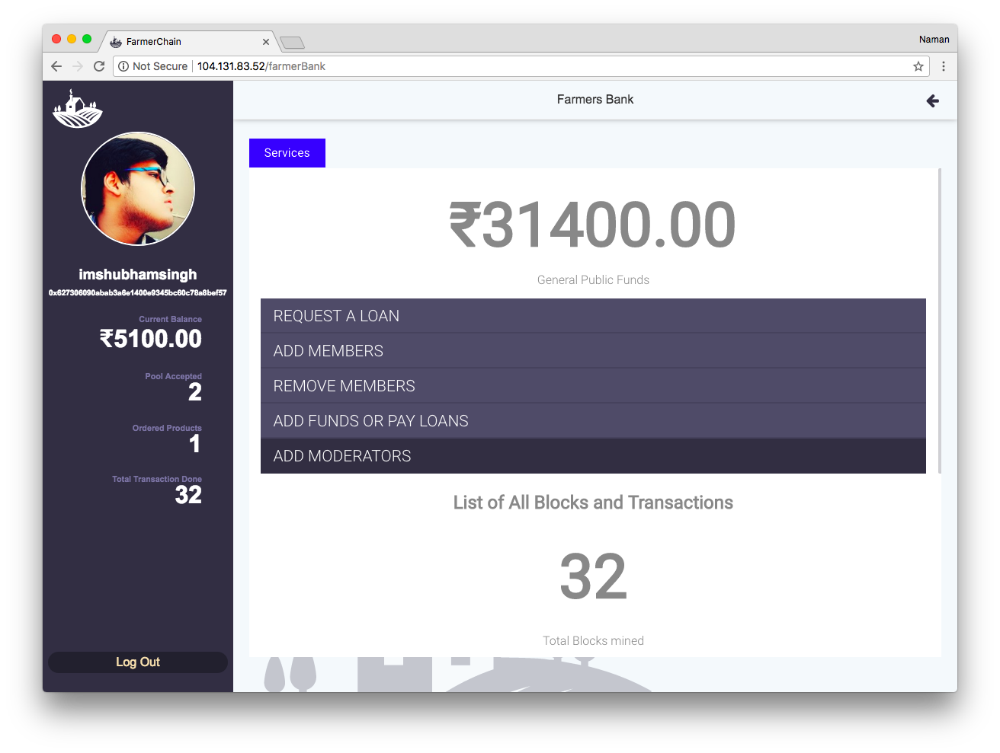
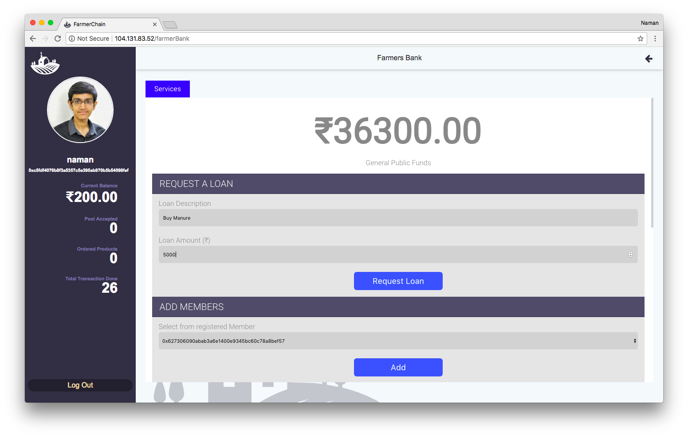
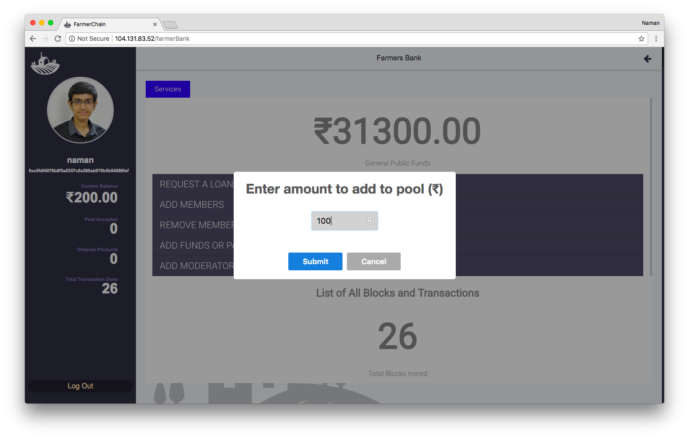
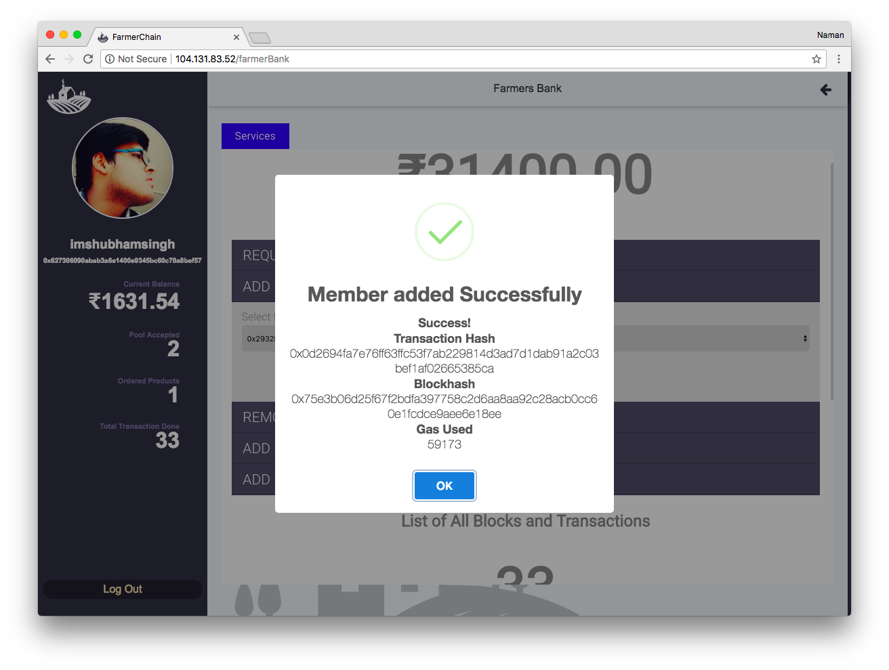
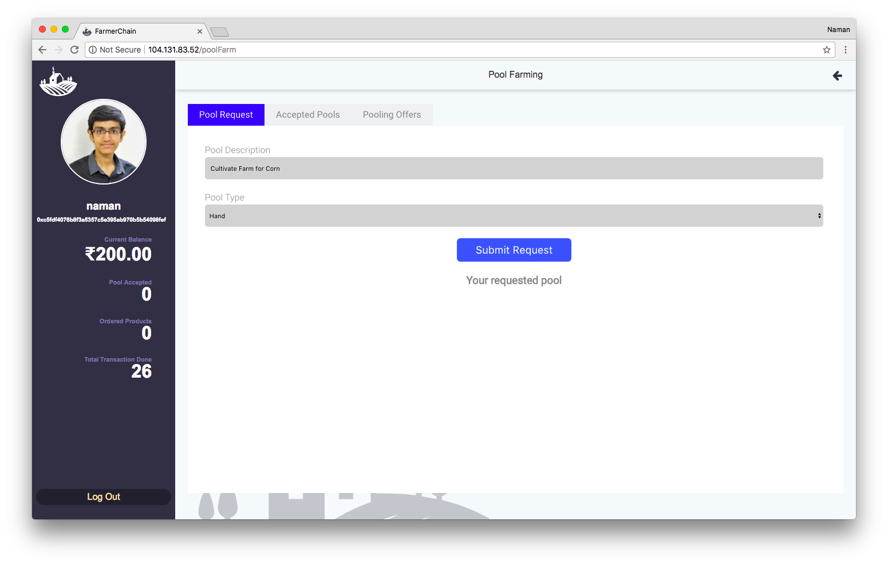
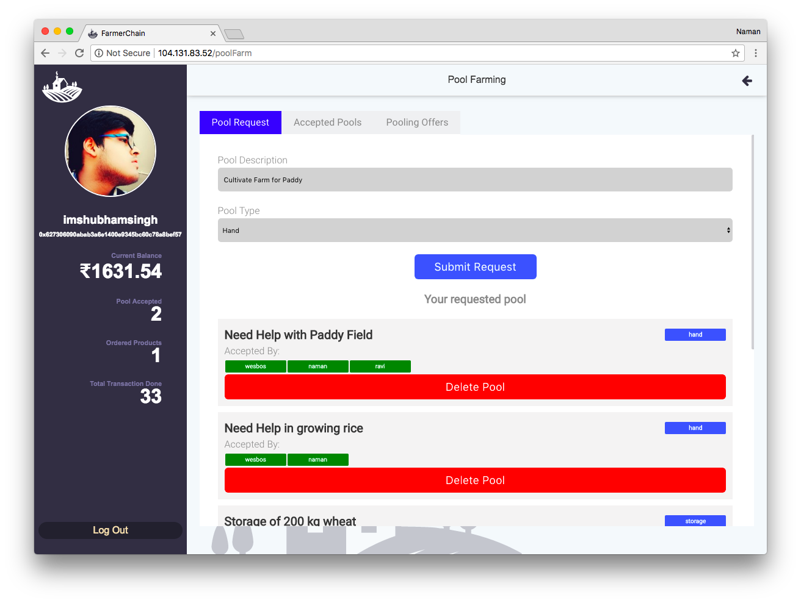
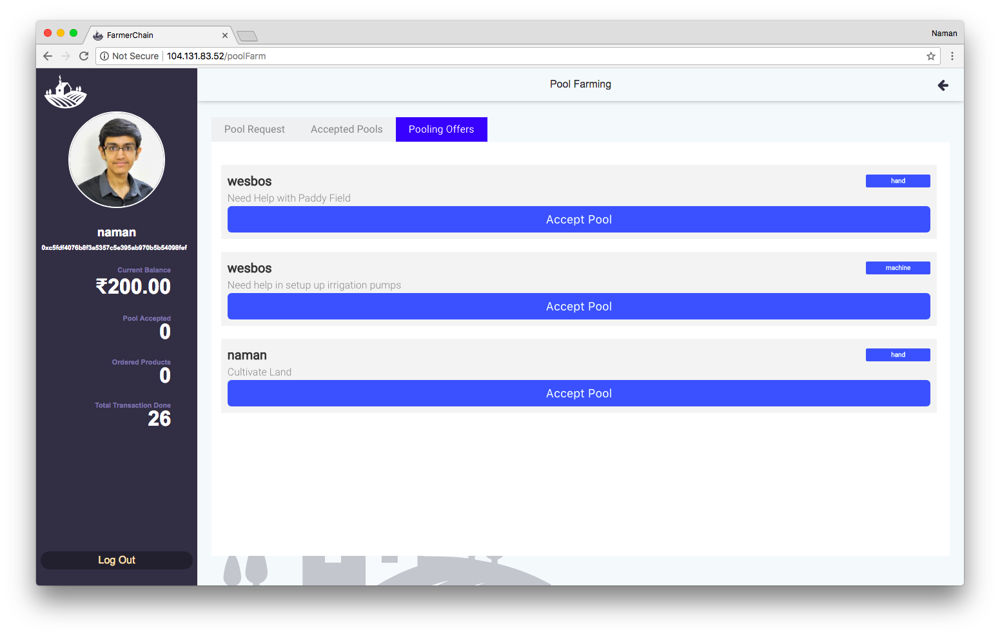
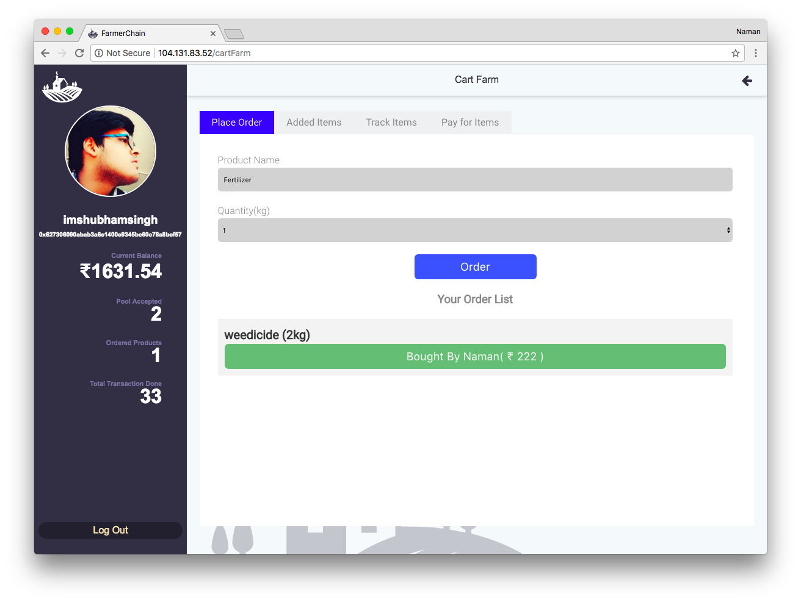

<h1 align="center">

 
 FarmerChain
</h1>
<h4 align="center">A blockchain based collaborative pool-farming system and self-financing platform</h4>

 

FarmerChain was built for the DigitalOcean Campus Champ in an attempt to provide a solution to the stinging problem of lack of organised banking in the rural sector.

The application is hosted on DigitalOcean and a working prototype can found <a href="http://104.131.83.52/">here</a>.

#### Dummy Accounts

Our prototype uses [truffle](http://truffleframework.com/) framework for its blockchain implementation. Since truffle is limited to 10 accounts, no more accounts can be created on our platform. Some dummy accounts have thus been provided for you to test the project.

|           Username          |    Password   |
|:---------------------------:|:-------------:|
| imshubhamsingh007@gmail.com | welcome@54321 |
| test1@test.com              | welcome@54321 |
| namangupta111@gmail.com     | welcome@54321 |

The application itself is divided into three parts.

1. Farmer Bank
2. Pool Farming
3. Cart Farm

***

&nbsp;

## Farmer Bank

Banking in the rural sector has always been haphazard. Farmers in India historically have depended on the indigenous banking system consisting of shroffs, money lenders and traders, charging absurdly high amounts of interest, for meeting their short term and long term credit requirements. One of the main reasons organised banking hasn’t penetrated rural India is mainly due to absence of collateral security. The higher operating costs and lower margins kept these banks outside making it a monopoly of the money lenders who are sucking the ordinary farmer dry reducing them to pitiful conditions.

Farmer Bank aims to solve the problem with a smart contract built for managing a pool of money contributed by a group of members and processing loan requests from the members. Currently, Farmer Bank processes loan requests based on the following criteria:

    1. Only members can add funds or request loans
    2. A member can request twice the amount he put in.
    3. The maximum loan that is issued is half the total amount in the pool.

This is done to prevent the pool from getting drained and promote sustenance. As with most blockchain based solutions, Farmer Bank derives its powers from a large set of users.

 

Members can add money to the pool

Adding a member requires moderator or owner privileges(analogous to a *Sarpanch* or *Panch* in rural settings).

## Pool Farming
Pool Farming is a platform based on shared economy facilitating exchange of three different types of services: Hand, Machine and Storage.

**Hand** : Meant for exchanging manpower  
**Machine** : Meant for exchanging tools and machinery  
**Storage** : Meant for exchanging the use of storage facilities.

## Cart Farm

Cart Farm is a platform for requesting and outsourcing the need for bringing and delivering supplies. Going to town? You can collect requests from others and bring them their required goods in exchange for a small commission.

You can even pay for the purchase directly on the platform also powered by blockchain technology!

***

# Running a local instance

- Clone the repo `git clone https://github.com/imshubhamsingh/FarmerChain.git`
- `cd FarmerChain`
-  Edit `.env` file with firebase configuration
- Start truffle blockchain using `truffle develop`
- In the truffle console, `compile` then `migrate`
- Open a new terminal and cd into the folder, then run `npm build`
- Navigate to `localhost:5020`

***
# Tech Stack

## Front End
1. [React JS](https://reactjs.org/)
1. HTML5
1. CSS3
1. [Web3](https://github.com/ethereum/web3.js/)

## Back End
1. [Truffle](http://truffleframework.com/)
2. [Webpack](https://webpack.js.org/)
3. [NodeJS](https://nodejs.org/en/)
5. [Ethereum Solidity](https://github.com/ethereum/solidity)

## License 

Copyright (c) 2017 Naman Gupta & Shubham Singh, This software is licensed under the [MIT License](LICENSE.txt).